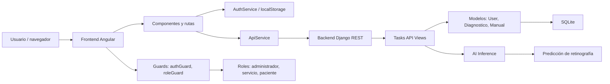
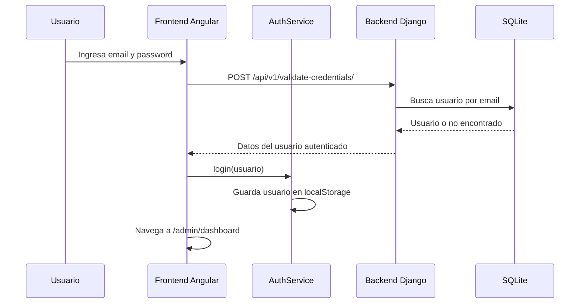
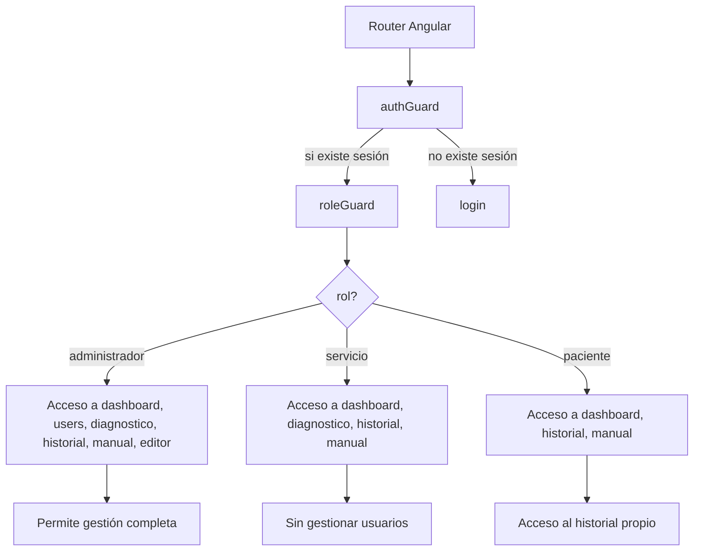
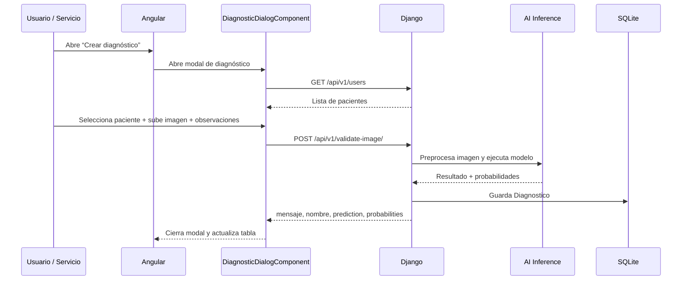
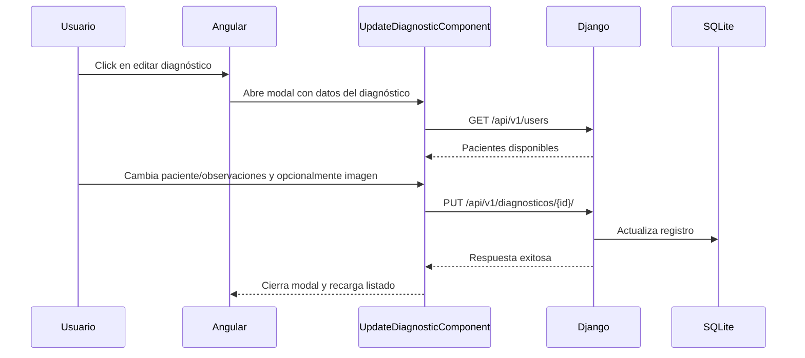
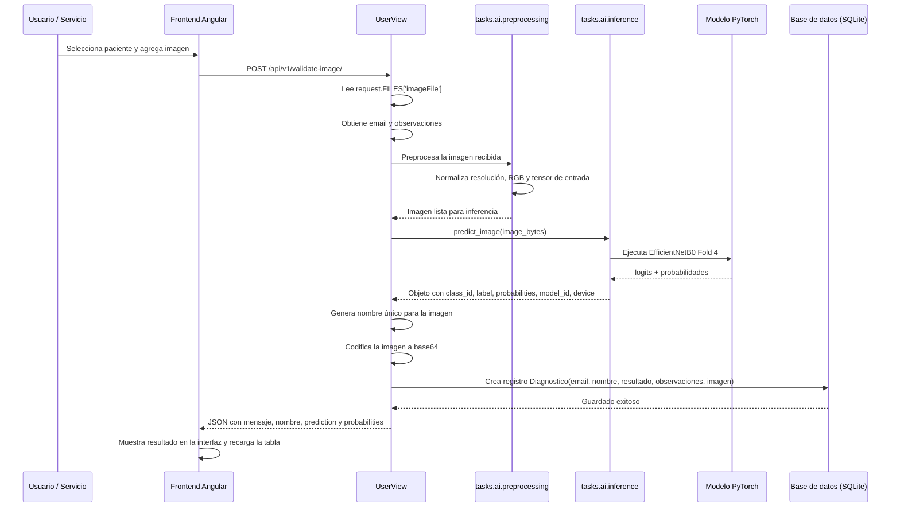
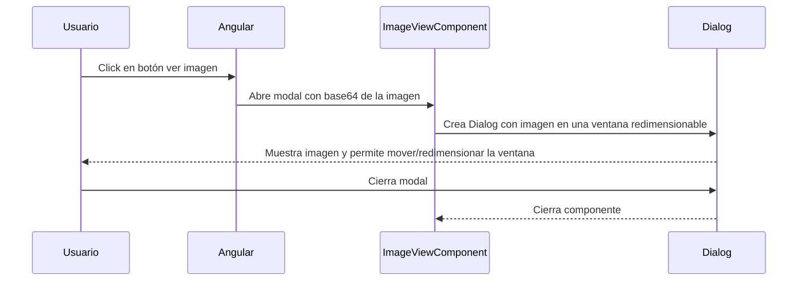
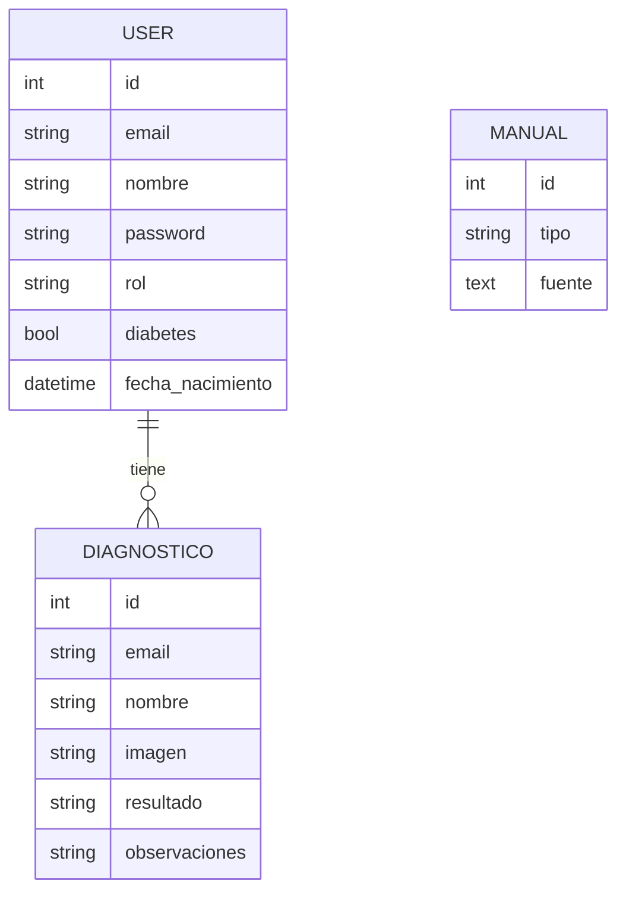
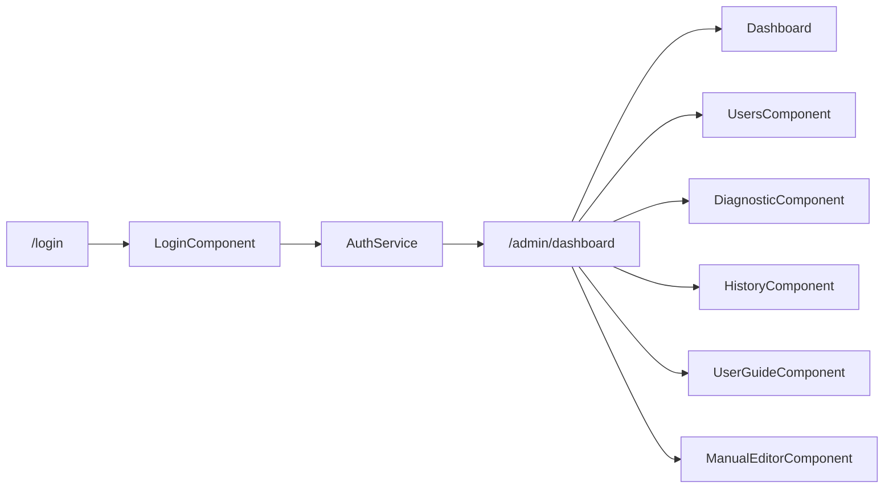

# Documentación de la lógica de la aplicación

Este documento resume la arquitectura, los flujos principales y la lógica de negocio de la aplicación Angular + Django.

## 1) Arquitectura general



## 2) Flujo principal de autenticación



## 3) Lógica de permisos y roles



## 4) Flujo de creación de diagnóstico



## 5) Flujo de edición de diagnóstico



## 6) Flujo detallado del backend para generar un diagnóstico



## 6.1) Lógica de preprocesado e inferencia

- El backend recibe la imagen desde el frontend como `request.FILES['imageFile']`.
- La imagen se lee una sola vez para evitar duplicar el flujo de datos.
- Se ejecuta `predict_image(image_bytes)` desde el módulo de IA.
- El preprocesado prepara la retinografía para el formato requerido por el modelo, incluyendo conversiones y normalización necesarias para la entrada del modelo de PyTorch.
- El modelo devuelve la clase predictiva y las probabilidades por clase.
- El sistema guarda la imagen codificada en base64 dentro del modelo `Diagnostico` para poder visualizarla luego en la vista de detalle/imagen.
- Además, se guarda el resultado textual del diagnóstico y las observaciones del usuario.

## 7) Flujo de visualización de imagen



## 8) Lógica de datos / modelos



## 9) Endpoints principales del backend

```text
/api/v1/users
  - GET: listar usuarios
  - POST: crear usuario
  - PUT/PATCH/DELETE: gestión por id

/api/v1/diagnosticos
  - GET: listar diagnósticos
  - POST: crear diagnóstico (si se usa en alguna ruta de servicio)
  - PUT/PATCH/DELETE: edición y eliminación por id

/api/v1/manuals
  - GET/POST/PUT/DELETE: CRUD de manuales

/api/v1/validate-credentials/
  - POST: login

/api/v1/validate-image/
  - POST: subir imagen para inferencia y guardar diagnóstico
```

## 10) Lógica de negocio resumida

### Frontend
- El usuario inicia sesión con credenciales.
- Los guards validan si hay sesión activa y el tipo de rol.
- El `AuthService` guarda los datos del usuario en `localStorage`.
- `role-access.config.ts` define qué pantallas puede abrir cada rol.
- Los componentes de historial, diagnóstico y usuarios consumen endpoints del backend.
- La imagen del diagnóstico se maneja como base64 y se presenta en un modal especial.

### Backend
- Django REST Framework expone CRUD para usuarios, diagnósticos y manuales.
- `User.authenticate()` valida contraseña local.
- `UserView.evaluateImage()` recibe la imagen, la procesa con IA, obtiene la predicción y la guarda en la base de datos.
- `DiagnosticoSerializer` agrega `paciente_nombre` buscándolo por el email del paciente.
- Los modelos quedan en SQLite por defecto (`db.sqlite3`).

## 11) Mapa de rutas principales



## 12) Resumen ejecutivo

La aplicación sigue un patrón clásico de frontend Angular + backend Django REST:

1. El usuario inicia sesión.
2. El frontend usa guards para controlar acceso según el rol.
3. El backend valida credenciales y procesa imágenes con IA.
4. Los diagnósticos se persisten en SQLite.
5. El frontend presenta tablas, formularios, historiales y la visualización de imágenes.

Este diseño permite poner la lógica de IA en el backend y mantener el frontend orientado a interfaz y experiencia de usuario.
